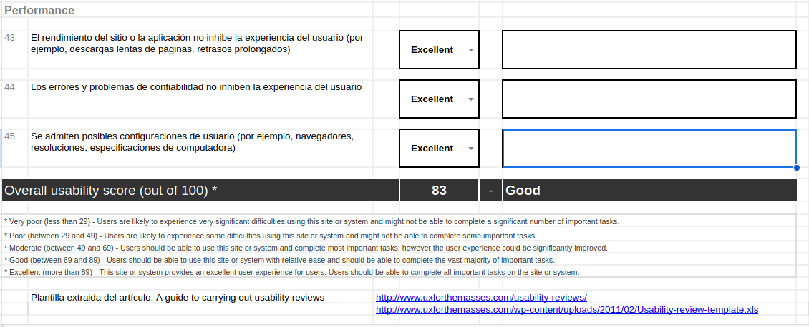

# TrabajoFinalDIU

Trabajo Final Diseño Interfaces de Usuario 2023-24

Hecho por: Jose Francisco López Rubio (DIU1)

## PARTE 1. Mi experiencia UX

Para esta primera parte del trabajo final de la asignatura, voy a realizar una evaluación, bajo mi experiencia, en el ámbito de las interfaces de usuario y la usabilidad de las webs, en el área de las interfaces de usuario y la usabilidad de los sitios web, abarcando tanto el entorno académico como el profesional. En el transcurso de la asignatura, se realizaron múltiples actividades que me ayudaron a adentrarme más en los fundamentos teóricos y prácticos del diseño centrado en el usuario, sobre las que voy a profundizar a continuación:

### Actividades

En la primera actividad, a modo introductorio a la asignatura y de forma bastante básica y sencilla, obtuve un papel como observador de una situación de la vida cotidiana y realicé una actividad etnográfica, donde detecté problemas en la interacción con un sistema de reserva de entradas online basado en un caso de estudio real sucedido en el entorno familiar. Para la realización de la actividad, se rellenó una tabla con diferentes campos en la que se recogían aspectos de la situación observada, como los factores críticos o aspectos mejorables. Dado que la persona de mi estudio, sobre todo debido a su edad y conocimiento en las tecnologías, tenía problemas para comprender las instrucciones y el funcionamiento de la propia web, podría decir que éste fue un caso algo más genérico pero más habitual de lo que se debería. Esta actividad me sirvió para adentrarme en los aspectos relacionados al usuario de una forma más externa y analizar comportamientos que, bajo mi punto de vista, puedan parecer familiares y sencillos, pero desde otra perspectiva cambia completamente la experiencia de usuario, lo que comenzó a servir de base para la realización de casos más prácticos y ayudó a entender lo importante que es tener en cuenta la diversidad de usuarios al diseñar interfaces.

Para la segunda actividad, llevé a cabo un análisis exhaustivo de una página web de una galería de arte granadina, “Granada Capital”, utilizando un formato de lista paso a paso para evaluar su estructura. Gracias a ella, junto con mis compañeros, descubrimos diversos inconvenientes en la navegación, diseño y estructura visual no observados en otras páginas de la competencia y que, una vez descritos y puestos en común, pueden ser aspectos significativos que cambien la experiencia de un usuario a otro. Este análisis estableció un poco más en profundidad las bases de los proyectos realizados en las prácticas y conocer aspectos positivos y mejorables de una web para poder aplicarlo de forma correcta en la web a realizar, fomentando mi habilidad para analizar de manera ordenada un sitio online.

A continuación, continuando con el análisis y construcción de un proyecto desde las bases, realizamos por grupos un Moodboard, que se trata de un tablón en el que se recogen los aspectos de diseño gráfico y técnicos más importantes de un proyecto, como lo son el objetivo y descripción del proyecto, la fuente / tipografía elegida para la web, así como la paleta de colores básicos y de contraste, inspiraciones del diseño de otras webs y de usuarios, y el logotipo. Junto con mi grupo, aportamos una propuesta de proyecto de las elegibles un tanto diferente: un sitio web de comida exótica. Seleccionamos una combinación de colores básicos y modernos, pero que recordaran a los ambientes forestales y empleamos fotografías de alta calidad que transmitían frescura y apetitosidad. Además, mediante las opiniones de posibles usuarios, pudimos adaptar el diseño a preferencias y expectativas reales plausibles, lo que nos pudo llevar un paso más allá en el análisis de las interfaces de usuario y cómo los aspectos descritos se diseñan y combinan para llegar a un producto final más atractivo, así como la importancia de los mismos en contraste a lo irrelevante que parecen en las diferentes etapas del diseño. Creo que esta actividad fue una de las más importantes e interesantes de toda la asignatura ya que es la que más nos sirvió para su posterior realización aplicada al proyecto de prácticas, y en la que mejor se ven los aspectos visuales más banales tomar la importancia que se merecen.

Otro aspecto de mi formación por la asignatura fue el ejercicio de accesibilidad, donde evalué el nivel de accesibilidad del sitio web de un ayuntamiento, en concreto el de Málaga, utilizando herramientas automáticas y simuladores de discapacidad. La evaluación técnica con herramientas como WAVE reveló diversos problemas, unos más graves que otros, como la falta de etiquetas ALT en imágenes y contrastes insuficientes, relacionados con los conocimientos vistos en los temas y seminarios. Por otro lado, al usar simuladores para experimentar cómo los usuarios con diferentes discapacidades perciben el sitio, como Funkify, detecté problemas adicionales en cuanto a la experiencia para usuarios, en concreto, que poseían discapacidades motoras, como el parkinson, pues, estos usuarios poseen mayores dificultades para navegar por la web que aquellos con problemas de vista. Esta combinación de evaluación automática y simulación práctica me proporcionó una visión más completa y específica de los problemas de accesibilidad y una visión diferente de cómo usuarios con distintas capacidades gestionan su manejo por distintos sitios web, así como adquirir más conocimiento y aptitudes para evitar situaciones complicadas para dichos usuarios.

Por último, para la última actividad tuve la oportunidad de diseñar una propuesta animada en Figma para un sitio web, en mi caso, de hamburguesas, utilizando un fichero de base que ya contenía el carrousel como efecto principal pero adaptado a la nueva propuesta. Implementé un carrusel animado que muestra diferentes tipos de hamburguesas, destacando la variedad y calidad del producto con imágenes de calidad. Utilizamos las diferentes herramientas en Figma para crear una variante que demostrara innovación y creatividad, dando lugar a un buen diseño y con unos visuales pulidos. Este proyecto nos ayudó a familiarizarnos con las herramientas de animación de Figma, pues en la asignatura no se han hecho mucho uso, de una forma algo más compleja a la que estábamos acostumbrados, para dejar los proyectos con un acabado más limpio y moderno.

### Prácticas 

Otro aspecto a tratar en esta primera parte es la parte práctica de la asignatura, dividida en 4 prácticas en las que se tratan los distintos contenidos abordados en la teoría. La realización de los estudios de usabilidad de diferentes sitios web y la creación de una propuesta de proyecto, utilizando los conocimientos adquiridos durante la asignatura, creo que han sido una forma muy enriquecedora de abordar el tema de la usabilidad y el diseño de interfaces de usuario y ha sido útil, no solo en el ámbito académico, sino para propósitos más profesionales al ser aplicable a futuros proyectos de la forma que se ha abordado en las prácticas, puliendo habilidades y conocimientos para seguir mejorando las experiencias de usuario.

Comenzando por el análisis de usabilidad y la investigación de usuario llevada a cabo en la fase inicial del proyecto, la evaluación comparativa de diferentes sitios web y la creación de personas basadas en diversos intereses y personalidades permitieron una comprensión más profunda de las posibles necesidades del usuario bajo distintos puntos de vista. Aunque no estuvo del todo claro en las fases iniciales del proyecto, considero que esta primera práctica asentó las bases de nuestro futuro proyecto final, pues aseguró que las decisiones de diseño estuvieran bien fundamentadas y alineadas con las expectativas de los usuarios, además de contrastadas con otras webs que han funcionado como inspiración, tanto los aspectos positivos como los negativos. Mediante nuestra evaluación de la web de teatro “La Estupenda” nos fijamos en qué queríamos y cómo queríamos que el usuario pudiera usar nuestra aplicación, tanto los aspectos positivos como los negativos, y retarnos a crear una mejor versión en cada etapa del proyecto.

Continuando por una segunda práctica, donde asentamos las bases y estructura inicial de nuestro proyecto, gracias a elementos como el User Journey Map previamente analizado o el Scope Canvas, donde se puede ver de un vistazo los valores que queríamos plasmar en nuestra aplicación, pudimos ser capaces, como equipo, de identificar y abordar problemas críticos de usabilidad descubiertos con anterioridad, para crear una versión inicial en la que mejorar y retarnos constantemente. Por medio de los Wireframes y el Sitemap, junto con el Labelling (la estructura de la web y la información contenida en cada parte), se puede observar el diseño que buscábamos conseguir, y que terminamos puliendo en prácticas posteriores.

La tercera práctica, bajo mi punto de vista, ha resultado ser la más importante y extensa de realizar, pues, usando como base todo lo realizado hasta este punto, conseguiríamos tener un prototipo final de nuestra web que pueda ser evaluable por otros grupos, mediante la realización de un logotipo e iconos, elección de tipografía y, lo más satisfactorio, el Mockup o diseño visual de nuestra web. Para esta parte, el Moodboard fue un elemento crucial en el acabado visual, ya que estableció las bases en forma de panel y resumía de forma sencilla pero completa nuestro objetivo y propósitos plasmado en los diferentes elementos gráficos usados en la app, para lo que fue muy importante la realización de la actividad 3. La razón por la que creo que ésta ha sido la parte más relevante de todas las del proyecto es porque considero que es la más útil y donde más se ha trabajado sobre el acabado del proyecto, enfocándonos en cómo el usuario visitaría nuestra web y su estructura de interfaz de una forma más profunda y donde más se han visto reflejados los contenidos adquiridos en el curso de la asignatura.

Por último, en la cuarta práctica y como aportaciones adicionales, hemos conseguido demostrar en equipo aplicar nuestras habilidades adquiridas mediante la evaluación de otros proyectos. La utilización de metodologías y herramientas avanzadas, como el Eye Tracking y el A/B testing, en la evaluación del proyecto asignado "Gaming Center" muestra una capacidad para aplicar conocimientos de usabilidad y diseño de interfaces bajo un punto de vista más externo. Esta experiencia no solo ayuda a afianzar la comprensión teórica del temario, sino que también fortalece la competencia profesional, preparando a los miembros para enfrentar desafíos en diversos campos relacionados con la tecnología y el diseño en dinámicas de equipo y evaluar otros aspectos de forma objetiva y profesional.

En conclusión, considero que las prácticas y actividades realizadas en el curso han sido un reflejo del compromiso y la calidad del trabajo del equipo. Por un lado, las aportaciones en el contexto de ejercicios y actividades de clase me han permitido desarrollar competencias clave esenciales para diseñar interfaces efectivas y centradas en el usuario. Por otro lado, por medio de las distintas prácticas hemos conseguido, mediante dinámicas de equipo, aplicar dichas aptitudes aprendidas de forma más visual e interactiva, complementando la formación y proporcionando una base sólida para futuras contribuciones en el campo del diseño de experiencia de usuario. Además, las experiencias y habilidades de trabajo en equipo adquiridas durante este proyecto van más allá del ámbito académico, pues considero que todo lo aprendido en esta asignatura tiene la utilidad de servir en futuros proyectos profesionales u otros ámbitos con una perspectiva ya formada y centrada en el usuario. Cabe destacar la utilidad del aprendizaje del uso de la principal herramienta de diseño de la asignatura, Figma, que me permitirá tener una base sobre la que profundizar en técnicas avanzadas de prototipado y animación, y continuar aplicando mis conocimientos en contextos profesionales para enfrentar nuevos desafíos reales, lo que me permitirá seguir creciendo y consolidando mi experiencia.

## PARTE 2. Caso de estudio

Para analizar las propuesta elegida, en mi caso, el Centro de Investigación en Tecnologías de la Información y de las Comunicaciones de la Universidad de Granada (CITIC-UGR - https://citic.ugr.es/), he usado la plantilla de Website Checklist realizada en la actividad 2 y la tabla de Usability Review para analizar la usabilidad y experiencia de usuario.

### Web Design Checklist

El diseño es moderno y profesional, enfocándose de forma clara en la funcionalidad. La paleta de colores es acertada, facilitando la lectura y no entorpeciendo la navegación. Además, posee un diseño responsive muy bien adaptado, garantizando su visualización en distintos dispositivos.

### Usability Review

En cuanto a la usabilidad, los menús son claros y concisos, y la información está bien estructurada, pero solo es accesible desde el mapa del sitio, y si quieres volver a una sección de, por ejemplo, Contacto, cuando estás en otra pestaña, te obliga a hacerlo desde el sitemap. Los iconos pueden no resultar muy intuitivos, y hay pocos elementos que guien al usuario por el sitio.

La nota final es un 83, lo que significa que es una buena web, bien estructurada, con un diseño sencillo que permite navegación fluida y contenido relevante y enfocado, pero hay ciertos aspectos de accesibilidad que podrían mejorarse, como la búsqueda (añadir más filtros), más enlaces directos a otras secciones relevantes y más descripción de la información en el home page.
